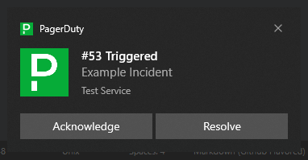

 FreshPager
===

[](https://github.com/Aldaviva/FreshPager/actions/workflows/dotnet.yml) [![Testspace](https://img.shields.io/testspace/tests/Aldaviva/Aldaviva:FreshPager/master?passed_label=passing&failed_label=failing&logo=data%3Aimage%2Fsvg%2Bxml%3Bbase64%2CPHN2ZyB4bWxucz0iaHR0cDovL3d3dy53My5vcmcvMjAwMC9zdmciIHZpZXdCb3g9IjAgMCA4NTkgODYxIj48cGF0aCBkPSJtNTk4IDUxMy05NCA5NCAyOCAyNyA5NC05NC0yOC0yN3pNMzA2IDIyNmwtOTQgOTQgMjggMjggOTQtOTQtMjgtMjh6bS00NiAyODctMjcgMjcgOTQgOTQgMjctMjctOTQtOTR6bTI5My0yODctMjcgMjggOTQgOTQgMjctMjgtOTQtOTR6TTQzMiA4NjFjNDEuMzMgMCA3Ni44My0xNC42NyAxMDYuNS00NFM1ODMgNzUyIDU4MyA3MTBjMC00MS4zMy0xNC44My03Ni44My00NC41LTEwNi41UzQ3My4zMyA1NTkgNDMyIDU1OWMtNDIgMC03Ny42NyAxNC44My0xMDcgNDQuNXMtNDQgNjUuMTctNDQgMTA2LjVjMCA0MiAxNC42NyA3Ny42NyA0NCAxMDdzNjUgNDQgMTA3IDQ0em0wLTU1OWM0MS4zMyAwIDc2LjgzLTE0LjgzIDEwNi41LTQ0LjVTNTgzIDE5Mi4zMyA1ODMgMTUxYzAtNDItMTQuODMtNzcuNjctNDQuNS0xMDdTNDczLjMzIDAgNDMyIDBjLTQyIDAtNzcuNjcgMTQuNjctMTA3IDQ0cy00NCA2NS00NCAxMDdjMCA0MS4zMyAxNC42NyA3Ni44MyA0NCAxMDYuNVMzOTAgMzAyIDQzMiAzMDJ6bTI3NiAyODJjNDIgMCA3Ny42Ny0xNC44MyAxMDctNDQuNXM0NC02NS4xNyA0NC0xMDYuNWMwLTQyLTE0LjY3LTc3LjY3LTQ0LTEwN3MtNjUtNDQtMTA3LTQ0Yy00MS4zMyAwLTc2LjY3IDE0LjY3LTEwNiA0NHMtNDQgNjUtNDQgMTA3YzAgNDEuMzMgMTQuNjcgNzYuODMgNDQgMTA2LjVTNjY2LjY3IDU4NCA3MDggNTg0em0tNTU3IDBjNDIgMCA3Ny42Ny0xNC44MyAxMDctNDQuNXM0NC02NS4xNyA0NC0xMDYuNWMwLTQyLTE0LjY3LTc3LjY3LTQ0LTEwN3MtNjUtNDQtMTA3LTQ0Yy00MS4zMyAwLTc2LjgzIDE0LjY3LTEwNi41IDQ0UzAgMzkxIDAgNDMzYzAgNDEuMzMgMTQuODMgNzYuODMgNDQuNSAxMDYuNVMxMDkuNjcgNTg0IDE1MSA1ODR6IiBmaWxsPSIjZmZmIi8%2BPC9zdmc%2B)](https://aldaviva.testspace.com/spaces/283429) [](https://coveralls.io/github/Aldaviva/FreshPager?branch=master)

When Freshping detects an outage, trigger an alert in PagerDuty (and resolve when it's up again).

<ul>
📟 Convert Freshping check failures into PagerDuty incidents.<br/>
🚨 Turn on a smart outlet when an incident is triggered.<br/>
🍞 Show an interactive desktop toast notification when an incident is triggered.
</ul>

This is helpful because Freshping's only built-in notification system is email, and the Gmail Android app is extremely slow to notify you of new messages: notifications are often hours late. PagerDuty, on the other hand, has realtime alerting with SMS messages and mobile app push notifications for Android and iOS.

This is a free, open-source, no sign-up, self-hostable alternative to the [Zapier Freshping + PagerDuty integration](https://zapier.com/apps/freshping/integrations/pagerduty/1146377/trigger-new-incidents-in-pagerduty-for-new-freshping-alerts).

<!-- MarkdownTOC autolink="true" bracket="round" autoanchor="false" levels="1,2,3" bullets="-,1.,-,-" -->

- [Prerequisites](#prerequisites)
- [Freshping Checks → PagerDuty Incidents](#freshping-checks-%E2%86%92-pagerduty-incidents)
    1. [Installation](#installation)
    1. [Configuration](#configuration)
    1. [Execution](#execution)
    1. [Signal Flow](#signal-flow)
- [PagerDuty Incidents → Desktop Push Notifications](#pagerduty-incidents-%E2%86%92-desktop-push-notifications)
    1. [Installation](#installation-1)
    1. [Configuration](#configuration-1)
    1. [Execution](#execution-1)

<!-- /MarkdownTOC -->

## Prerequisites
- [.NET Runtime 8 or later](https://dotnet.microsoft.com/en-us/download)
- [Freshping account](https://freshping.io/)
    - ⛔ [Freshworks disabled the ability to sign up for new Freshping accounts](https://support.freshping.io/en/support/solutions/articles/50000006524-suspension-of-new-signups-faqs) in 2023, so if you don't already have an account, you can't create one anymore.
    - All billing plans are compatible: Sprout (free, 5 integrations), Blossom (10 integrations), and Garden (15 integrations)
- Ability to listen on a public WAN TCP port for incoming HTTP requests from Freshping without being blocked by a NAT or firewall
- [PagerDuty account](https://www.pagerduty.com/sign-up/) (the [free plan](https://www.pagerduty.com/sign-up-free/?type=free) is sufficient)

## Freshping Checks → PagerDuty Incidents

### Installation
1. Download the ZIP file for your operating system and CPU architecture from the [latest release page](https://github.com/Aldaviva/FreshPager/releases/latest).
1. Extract the ZIP file to a directory of your choice, such as `C:\Program Files\FreshPager\` or `/opt/freshpager/`.
    - When installing updates, don't overwrite `appsettings.json`.
1. Install the service so it will start automatically when your computer boots.
    - Windows: `& '.\Install service.ps1'`
        - If this PowerShell script doesn't run, try removing the Mark of the Web by unblocking the file or calling `Set-ExecutionPolicy RemoteSigned`.
    - Linux with systemd:
        ```sh
        sudo cp freshpager.service /etc/systemd/system/
        sudo systemctl daemon-reload
        sudo systemctl enable freshpager.service
        ```
        - If the installation directory is not `/opt/freshpager/`, make sure to edit `freshpager.service` to match.

### Configuration
1. Create an Integration in PagerDuty and get its Integration Key.
    1. Sign into your [PagerDuty account](https://app.pagerduty.com/).
    1. Go to Services › Service Directory.
    1. Select an existing Service for which you want to publish events, or create a new Service.
    1. In the Integrations tab of the Service, add a new Integration.
    1. Under Most popular integrations, select Events API V2, then click Add.
    1. Expand the newly-created Integration and copy its **Integration Key**, which will be used to authorize this program to send Events to the correct Service.
1. Edit the `appsettings.json` configuration file.
    |Key|Example Value|Description|
    |-|-|-|
    |`pagerDutyIntegrationKeysByFreshpingCheckId`|<pre lang="json">{ "123": "abc…" }</pre>|Object where each key is the numeric ID of a check in Freshping (go to a Report page and copy the value of the <code>check_id</code> query parameter), and its value is the Integration Key you created for the matching PagerDuty Service in Step 1.|
    |`kestrel.endpoints.https.url`|`http://0.0.0.0:37374`|URI specifying the hostname and TCP port on which to listen for HTTP requests from the Freshping webhook client. Must be publicly accessible on the WAN.|
    |`pagerDutyWebhookSecrets`|<pre lang="json">["u565tpiQ3TnI…"]</pre>|Array of one or more PagerDuty webhook signing secrets, which are generated by PagerDuty when you create a new webhook subscription. Only required if you want to turn on smart outlets or show toast notifications on Windows.|
    |`alarmLightUrl`|`tcp://192.168.1.100/0`|URL with the hostname of a Kasa smart outlet that you want to turn on when a PagerDuty incident is triggered. Only required when controlling an outlet. The path is a 0-indexed integer that identifies which socket on the outlet to control, which can be 0 or the empty string if the outlet only has one socket. The scheme doesn't matter. Requires a PagerDuty Webhook and secret.|
    |`alarmLightPagerDutySubdomains`|<pre lang="json">["mycompany"]</pre>|Optional whitelist of PagerDuty account subdomains which should trigger the alarm light, useful if your server receives webhooks from multiple PagerDuty accounts but only some of them should turn on the alarm light. When omitted, events from all PagerDuty accounts will turn on the light, if it is configured.|
1. Create a Webhook integration in Freshping.
    1. Sign into your [Freshworks account](https://login.freshworks.com/email-login).
    1. Go to your Freshping Dashboard.
    1. Go to Settings › Integrations.
    1. Under Webhook, select **+ Create Integration**.
    1. Set the Webook Name to any name you want.
    1. Set the Event Type to Up/Down.
    1. Select the Checks that should trigger the alert.
    1. Set the Callback URL to the location of your FreshPager server, such as `http://myserver.example.com:37374/`.
    1. Leave the request body set to Simple.
    1. Click Save.
1. Create a Webhook integration in PagerDuty if you want to turn on a smart outlet or show toast notifications on Windows when incidents are triggered.
    1. Sign into your [PagerDuty account](https://app.pagerduty.com/).
    1. Go to **Integrations › Generic Webhooks (v3)**.
    1. Click **+ New Webhook**.
    1. Set the Webhook URL to the location of your FreshPager server, such as `http://myserver.example.com:37374/`.
    1. Choose whether events should be fired for all Services in your account, or just one Service.
    1. Choose which Events should be fired.
    1. Click **Add Webhook**.
    1. Copy the Signing Secret to the `pagerDutyWebhookSecrets` array in the FreshPager configuration JSON file.

### Execution
1. Start the service.
    - Windows: `Restart-Service Freshpager`
    - Linux with systemd: `sudo systemctl restart freshpager.service`

### Signal Flow
1.  Freshping detects and confirms that a Check is down.
1.  Freshping sends an HTTP POST request to each Webhook integration subscribed to Up/Down events on that Check.
1. Your  FreshPager server receives the HTTP POST request from  Freshping.
1.  FreshPager looks up the Integration Key in its configuration based on the Check ID from the request body.
1.  FreshPager sends an Events API V2 request to  PagerDuty to trigger an alert on the Service that contains the Integration Key.
1.  PagerDuty creates a new incident for this alert, and returns a unique key for this alert, which  FreshPager stores in memory.
1.  PagerDuty sends an HTTP POST request to  FreshPager with the newly triggered incident.
1. If configured to do so,  FreshPager sends a TCP JSON object to a Kasa smart outlet, commanding it to turn on its electrical socket.
1.  FreshPager sends a WebSocket message containing the newly triggered incident to any connected  FreshPager.Toast clients, which show Windows toast notifications.
1. When  Freshping detects that the Check is up again, it sends another POST request to  FreshPager, which resolves the previously-created  PagerDuty alert using the same unique key. If they are configured, the smart outlet will be turned off, and the toasts will be dismissed.

## PagerDuty Incidents → Desktop Push Notifications
PagerDuty makes it easy to receive push notifications for triggered incidents through their Android and iOS apps, SMS, email, and PSTN calls. However, it's not as easy to get an obvious, actionable notification if you're only on a computer while your phone isn't nearby. Phone Link is very unreliable and emails are easy to miss.

You can solve this with a background program that runs on Windows, connects to the FreshPager server, and receives push notifications for triggered incidents which it shows as native Windows toasts. These are rich notifications with buttons to acknowledge or resolve the incident with one click. You can also click on the body of the toast to open the incident web page in your browser.

<p align="center"></p>

### Installation
1. Download `FreshPager.Toast-win-x64` from the [latest release page](https://github.com/Aldaviva/FreshPager/releases/latest).
1. Extract the EXE from the ZIP file to your hard drive.
1. Register this program to start when you log into Windows by adding its absolute path to a new string value in the registry key `HKCU\SOFTWARE\Microsoft\Windows\CurrentVersion\Run`.

### Configuration
1. Create a configuration JSON file.
    1. Save the [example configuration file](https://github.com/Aldaviva/FreshPager/blob/master/FreshPager.Toast/appsettings.json) to `%appdata%\FreshPager\Toast.config.json`.
1. Set the `hubAddress` to the URL of your FreshPager server, with the path `/pagerduty/toasts`. *This connects the Toast client to the WebSocket server.*
1. Replace the `myorg` key in the `pagerDutyAccountsBySubdomain` object with the subdomain of your PagerDuty organization (the part of the hostname before the `.pagerduty.com` base domain in the web interface, not including that base domain). 
    - *This is used to determine which organization of the following information should be used for a given incident, if you are subscribed to webhooks from multiple organizations.*
1. Set the `userId` of the organization object to the ID of your user, which is the last path segment of your PagerDuty profile page accessible from People › Users.
    - *This is used to record which user acknowledged or resolved an incident.*
1. Set the `userEmailAddress` to your account's email address.
    - *This prevents you from receiving toasts for incidents which are assigned to different people.*
1. Create an API access key in PagerDuty.
    1. Sign into your [PagerDuty account](https://app.pagerduty.com/).
    1. Go to Integrations › API Access Keys.
    1. Click **+ Create New API Key**.
    1. Enter a descriptive name, and make sure **Read-only API Key** is unchecked.
    1. Click **Create Key**.
    1. Set the `apiAccessKey` in `Toast.config.json` to this new access key.
    - *This is used to acknowledge and resolve incidents, since Events V2 Integration Keys are not able to do this because they control alerts, not incidents.*

### Execution
1. Double-click the EXE file to start it. It will run in the background and not show any UI.